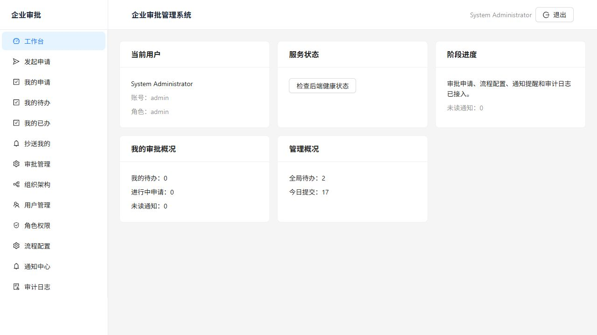

# 企业审批系统（Enterprise Approval SDD）

基于 SDD（Specification-Driven Development，规范驱动开发）从零设计并实现的企业级 Web 审批管理系统。

系统面向几十人规模的小型企业，重点解决审批慢、流程不透明、历史记录难追踪的问题。第一版已经完成从需求规格、技术方案、任务拆分到可运行 MVP 的闭环。

---

## 目录

- [功能特性](#功能特性)
- [技术架构](#技术架构)
- [项目结构](#项目结构)
- [快速开始](#快速开始)
- [默认账号](#默认账号)
- [测试与构建](#测试与构建)
- [数据库与迁移](#数据库与迁移)
- [验收状态](#验收状态)
- [规范文档](#规范文档)
- [安全与隐私](#安全与隐私)
- [后续计划](#后续计划)

---

## 功能特性

### 审批场景

- 请假审批
- 报销审批
- 采购审批
- 加班审批
- 出差审批

### 核心能力

- 登录认证、JWT、RBAC 角色权限和数据权限。
- 组织架构、用户、角色、权限管理。
- 草稿保存、申请提交、附件上传下载、我的申请和审批详情。
- 默认审批流程、流程模板配置、节点配置和流程启停。
- 我的待办、我的已办、抄送我的、审批时间线。
- 同意、驳回、撤回、补充材料、转交、加签、抄送、作废。
- 通知中心、未读通知、24 小时超时扫描。
- 审批管理列表、通用筛选、CSV 导出、导出审计。
- 工作台、轻量统计看板、审计日志。

---

## 技术架构

| 层级 | 技术 |
| --- | --- |
| 后端 | Java 1.8 兼容代码、Spring Boot 2.7.x、Spring Security、Spring Data JPA |
| 数据库 | PostgreSQL、Flyway |
| 前端 | React、TypeScript、Vite、Ant Design、TanStack Query |
| 认证 | JWT Bearer Token |
| 架构方式 | 单体应用起步，按领域分包，保留后续服务拆分空间 |
| 规范方式 | SDD：`spec.md` -> `plan.md` -> `tasks.md` -> 实现与验收 |

> 本机可以使用更高版本 JDK 运行 Maven，但项目编译目标保持 Java 1.8。

---

## 项目结构

```text
enterprise-approval-sdd/
├── AGENTS.md                         # 项目级智能体约束与工程规则
├── backend/                          # Spring Boot 后端
│   ├── pom.xml
│   └── src/
├── frontend/                         # React + Vite 前端
│   ├── package.json
│   └── src/
├── specs/
│   └── 001-enterprise-approval/
│       ├── spec.md                   # 需求规格说明
│       ├── plan.md                   # 技术实现方案
│       ├── tasks.md                  # 阶段任务清单
│       ├── acceptance.md             # 验收追踪记录
│       └── screenshots/              # 验收截图
├── requirements.txt
├── README.md
└── .gitignore
```

本地工具、数据库文件、上传附件、依赖和构建产物不会提交到 Git：

```text
tools/
backend/storage/
backend/target/
frontend/node_modules/
frontend/dist/
.env
.env.*
```

---

## 快速开始

以下命令均在项目根目录 `enterprise-approval-sdd` 下执行。

### 1. 启动 PostgreSQL

```powershell
.\tools\pgsql\bin\pg_ctl.exe -D .\tools\pgdata -l .\tools\pgdata\postgres.log start
```

### 2. 启动后端

```powershell
.\tools\apache-maven-3.9.9\bin\mvn.cmd -f .\backend\pom.xml spring-boot:run "-Dspring-boot.run.profiles=postgres"
```

后端健康检查：

```text
http://localhost:8080/api/health
```

### 3. 启动前端

```powershell
cd .\frontend
npm.cmd install
npm.cmd run dev
```

前端访问地址：

```text
http://localhost:5173/
```

### 4. 停止 PostgreSQL

```powershell
.\tools\pgsql\bin\pg_ctl.exe -D .\tools\pgdata stop
```

---

## 默认账号

| 用户名 | 密码 | 角色 |
| --- | --- | --- |
| `admin` | `admin123` | 系统管理员 |
| `employee01` | `admin123` | 普通员工 |
| `manager01` | `admin123` | 部门主管 |
| `finance01` | `admin123` | 财务人员 |
| `hr01` | `admin123` | 人事人员 |
| `gm01` | `admin123` | 总经理 |

> 默认账号仅用于本地开发和演示。生产环境必须通过环境变量配置安全密钥，并重置所有默认密码。

---

## 测试与构建

### 后端测试

```powershell
.\tools\apache-maven-3.9.9\bin\mvn.cmd -f .\backend\pom.xml test
```

当前结果：

```text
Tests run: 7, Failures: 0, Errors: 0, Skipped: 0
BUILD SUCCESS
```

### 前端构建

```powershell
cd .\frontend
npm.cmd run build
```

当前结果：

```text
tsc && vite build
✓ built
```

Vite 目前会提示主 JS chunk 超过 500 kB，这是性能优化提示，不影响当前构建通过。

---

## 数据库与迁移

默认连接信息：

```text
数据库：enterprise_approval
用户：postgres
端口：5432
JDBC：jdbc:postgresql://localhost:5432/enterprise_approval
```

迁移目录：

```text
backend/src/main/resources/db/migration
```

当前迁移：

```text
V1__create_foundation_tables.sql
V2__localize_default_rbac_names.sql
V3__create_approval_request_tables.sql
V4__create_minimal_workflow_tables.sql
V5__create_approval_cc_table.sql
V6__create_workflow_template_tables.sql
V7__create_notification_table.sql
```

数据库安全约束：

- 禁止生成 `DROP TABLE` 和 `DROP DATABASE`。
- 所有 SQL 必须使用参数化查询。
- 操作前必须验证环境，当前开发环境默认为 `app.environment=development`。
- 危险操作必须有二次确认机制。
- 业务数据不做物理删除，必须软删除。
- 表名按业务域使用 `sys_`、`org_`、`approval_`、`audit_` 等前缀。

---

## 验收状态

第一版 MVP 已完成阶段八验收和收口：

- 后端自动化测试通过。
- 前端 TypeScript 与生产构建通过。
- 核心业务接口检查通过。
- 浏览器页面检查通过。
- 验收追踪记录已整理在 [`specs/001-enterprise-approval/acceptance.md`](specs/001-enterprise-approval/acceptance.md)。

验收截图：



---

## 规范文档

- [`AGENTS.md`](AGENTS.md)：项目级智能体权限、行为约束和工作指导。
- [`spec.md`](specs/001-enterprise-approval/spec.md)：需求规格说明书。
- [`plan.md`](specs/001-enterprise-approval/plan.md)：技术实现方案。
- [`tasks.md`](specs/001-enterprise-approval/tasks.md)：任务拆分和阶段进度。
- [`acceptance.md`](specs/001-enterprise-approval/acceptance.md)：阶段八验收追踪记录。

---

## 安全与隐私

上传仓库前已做基础隐私保护：

- `.env`、`.env.*` 不提交。
- `tools/` 不提交，避免上传本地 PostgreSQL、Maven、缓存等工具文件。
- `backend/storage/` 不提交，避免上传用户附件和本地业务文件。
- `frontend/node_modules/`、`frontend/dist/`、`backend/target/` 不提交。
- 未发现真实 GitHub token、OpenAI API key、私钥等敏感值。

生产部署前建议：

- 使用环境变量覆盖 JWT secret。
- 重置所有默认账号密码。
- 使用独立生产数据库账号。
- 开启 HTTPS 和反向代理访问控制。

---

## 后续计划

- 引入 Playwright 或组件测试，覆盖登录、提交、审批、筛选、导出等端到端流程。
- 对前端按页面做动态导入，优化 Vite 大 chunk 警告。
- 补充平均审批耗时等管理统计口径。
- 为生产环境补充部署脚本、备份方案和日志保留策略。
